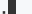

# indicatrix

[](https://www.npmjs.com/package/indicatrix)

`indicatrix` Is A CLI Loading Indicator Implemented As A Changing Ellipsis (Triple-Dot).


<p align="center"><a href="#table-of-contents">
  
</a></p>

```sh
yarn add -E indicatrix
```

## Table Of Contents

- [Table Of Contents](#table-of-contents)
- [API](#api)
- [`async indicatrix(text, promise, options=): T`](#async-indicatrixtext-stringpromise-promisetfunction-promisetoptions-options-t)
  * [`Options`](#type-options)
- [`INDICATRIX_PLACEHOLDER` env](#indicatrix_placeholder-env)
- [Copyright](#copyright)

<p align="center"><a href="#table-of-contents">
  
</a></p>

## API

The package is available by importing its default function:

```js
import indicatrix from 'indicatrix'
```

<p align="center"><a href="#table-of-contents">
  
</a></p>

## <code>async <ins>indicatrix</ins>(</code><sub><br/>&nbsp;&nbsp;`text: string,`<br/>&nbsp;&nbsp;`promise: !Promise<T>|function(...*): !Promise<T>,`<br/>&nbsp;&nbsp;`options=: !Options,`<br/></sub><code>): <i>T</i></code>
Will print the loading text and refresh the CLI line to show the ellipsis while the promise is loading.

 - <kbd><strong>text*</strong></kbd> <em>`string`</em>: The text to display in the CLI.
 - <kbd><strong>promise*</strong></kbd> <em><code>(!Promise&lt;T&gt; \| function(...*): !Promise&lt;T&gt;)</code></em>: The promise or an async function that returns the promise.
 - <kbd>options</kbd> <em><code><a href="#type-options" title="The optional options for the indicator, such as the refresh interval.">!Options</a></code></em> (optional): The optional options for the indicator, such as the refresh interval.

When called from the CLI application, `indicatrix` will print the supplied text and draw the ellipsis (`.` > `..` > `...` > `.`) animation at the end, until the promise is resolved.

__<a name="type-options">`Options`</a>__: The optional options for the indicator, such as the refresh interval.


|   Name   |                                   Type                                    |                             Description                              |     Default      |
| -------- | ------------------------------------------------------------------------- | -------------------------------------------------------------------- | ---------------- |
| interval | <em>number</em>                                                           | The interval with which to update the screen.                        | `250`            |
| writable | <em>!(NodeJS.WriteStream \| [stream.Writable](#type-streamwritable))</em> | The writable stream used for printing data with the `.write` method. | `process.stdout` |

```js
import indicatrix from 'indicatrix'

(async () => {
  const res = await indicatrix('Please wait', async () => {
    await new Promise(r => setTimeout(r, 750))
    return 'OK'
  }, { interval: 100 })
  console.log(res)
})()
```
```
Please wait.
Please wait..
Please wait...
Please wait
Please wait.
Please wait..
Please wait...
Please wait
```
```
OK            
```

<p align="center"><a href="#table-of-contents">
  
</a></p>

## `INDICATRIX_PLACEHOLDER` env

When the `INDICATRIX_PLACEHOLDER` is set to anything other than `0`, the package won't print the `...` ellipsis, but append the static `<INDICATRIX_PLACEHOLDER>` string to the loading text instead. This is used by [documentary](https://artdecocode.com/documentary/) to add an interactive placeholder:

<pre>Please wait<a id="_ind0" href="#_ind0"></a>
OK</pre>

<p align="center"><a href="#table-of-contents">
  
</a></p>

## Copyright

<table>
  <tr>
    <th>
      <a href="https://www.artd.eco">
        
      </a>
    </th>
    <th>© <a href="https://www.artd.eco">Art Deco™</a>   2020</th>
  </tr>
</table>

<p align="center"><a href="#table-of-contents">
  
</a></p>